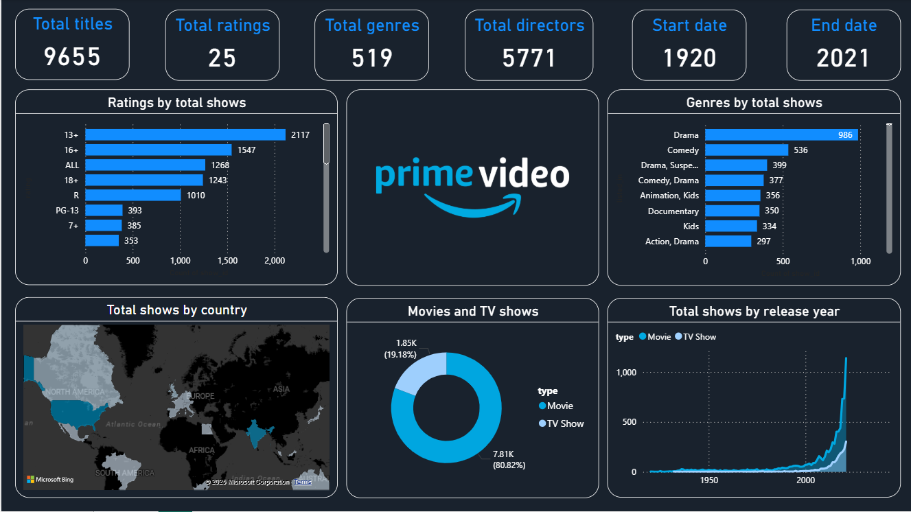

# Prime-Video-Insights-with-Power-BI

This project is a **Power BI dashboard** that analyzes Prime Video’s content library, providing insights into titles, genres, ratings, countries, and overall growth over time.

## 📊 Dashboard Overview

The dashboard highlights:

* **Total Titles**: 9,655
* **Total Ratings**: 25
* **Total Genres**: 519
* **Total Directors**: 5,771
* **Timeline**: 1920 – 2021

### Key Insights

* Distribution of shows by **rating** and **genre**
* Breakdown of **Movies vs TV Shows**
* Global spread of shows by **country**
* Trends in content growth across the years
* Most popular **genres** (Drama, Comedy, Documentary, etc.)

## 🛠 Tools Used

* **Power BI** → For visualization & dashboard building
* **Excel Dataset (zipped)** → Used for data preprocessing

## 📂 Project Files

* `PrimeVideo Analysis.pbix` → Power BI dashboard file
* `PrimeVideoTitles.zip` → Contains the Excel dataset used for this project
* `PrimeVideo Insights.png` → Snapshot of the dashboard
* `README.md` → Project documentation

## 🚀 How to Use

1. Download or clone this repository.
2. Extract the `dataset.zip` file to access the Excel dataset.
3. Open the `.pbix` file in **Power BI Desktop**.
4. Connect to the extracted dataset if required.
5. Explore the interactive dashboard!

## 📸 Dashboard Preview

## 🔑 Learnings & Takeaways

* Data cleaning and transformation in Excel/Power Query
* Creating interactive visuals in Power BI
* Building insights around streaming content trends
* Storytelling with data visualization

## 📬 Contact

If you’d like to connect or collaborate:

* **LinkedIn**: [LinkedIn Profile](http://linkedin.com/in/bhuvana-reddy-907a68339)
* **GitHub**: [GitHub Profile](https://github.com/Bhuvana908)

---

